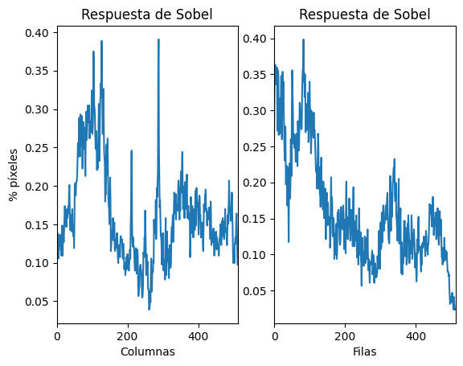
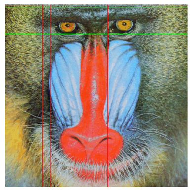
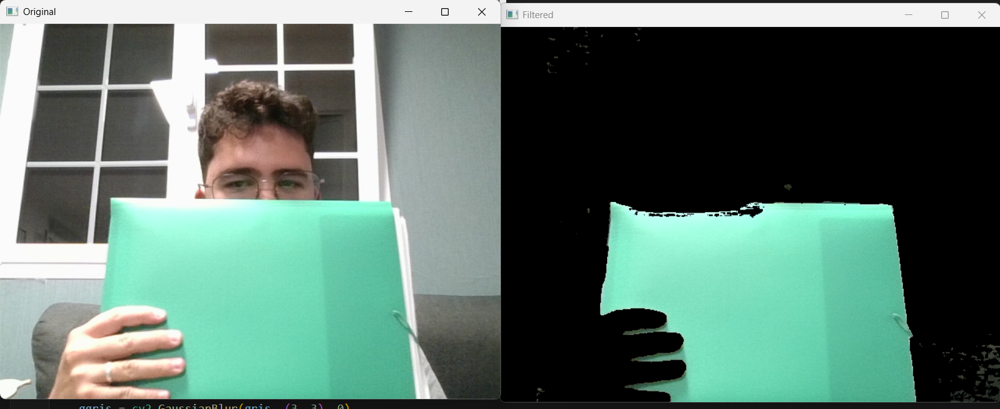
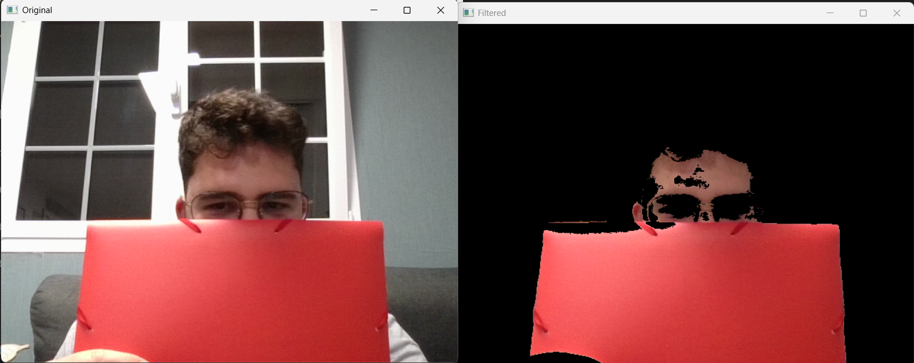
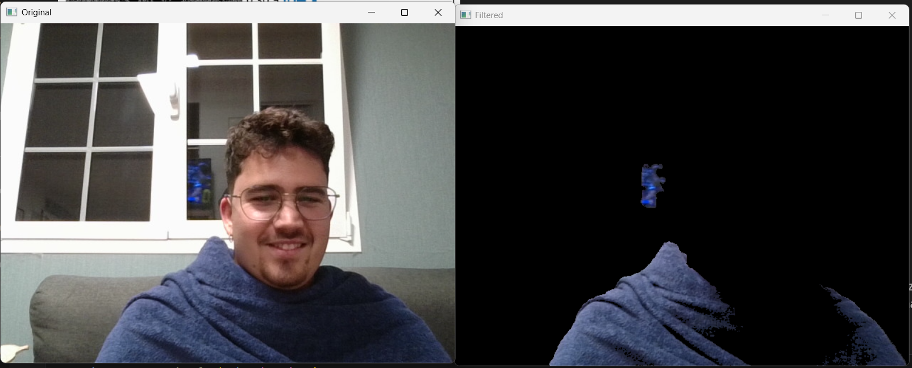
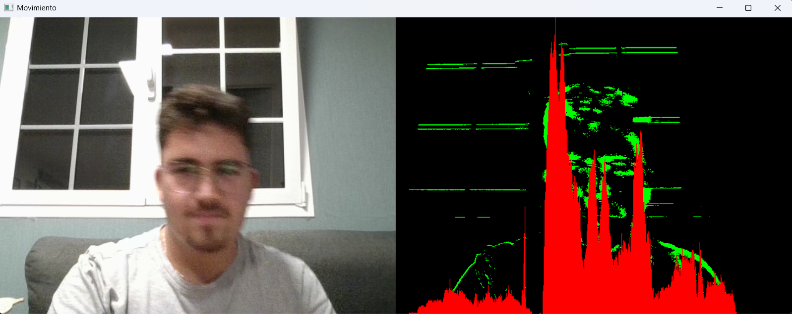

# Práctica 2 - Procesamiento de imágenes con Canny, Sobel y filtros en vídeo

El objetivo de esta práctica es aprender a **analizar imágenes mediante detección de bordes, realizar conteos por filas y columnas, aplicar filtros de color en tiempo real y diseñar un demostrador artístico** que combine visión por computador con creatividad.

## Autor

## Librerías
- OpenCV (`cv2`)
- NumPy
- Matplotlib
- Pillow

---

## TAREA 1: Conteo de píxeles blancos por filas con Canny

- **Paso 1:** Convertir la imagen del mandril a escala de grises.  
- **Paso 2:** Aplicar el detector de bordes de Canny.  
- **Paso 3:** Contar píxeles blancos por filas usando `cv2.reduce`.  
- **Paso 4:** Determinar el valor máximo y las filas con ≥ 90% de ese valor.  
- **Paso 5:** Mostrar gráficamente la respuesta y los resultados en consola. 

    

---

## TAREA 2: Umbralizado de Sobel y comparación con Canny

- **Paso 1:** Aplicar suavizado Gaussiano a la imagen en gris.  
- **Paso 2:** Calcular Sobel en X e Y, y combinar resultados.  
- **Paso 3:** Convertir a 8 bits y aplicar umbral binario.  
- **Paso 4:** Contar píxeles por filas y columnas, identificando los ≥ 90% del máximo.  
- **Paso 5:** Dibujar con primitivas gráficas las filas y columnas destacadas.  
- **Paso 6:** Comparar los resultados frente a Canny.  

    
    

---

## TAREA 3: Filtros de color en vídeo (modos con teclas)

- **Paso 1:** Capturar vídeo desde la webcam en tiempo real.  
- **Paso 2:** Convertir cada cuadro a espacio de color HSV.  
- **Paso 3:** Definir máscaras para verde, rojo y azul.  
- **Paso 4:** Filtrar dinámicamente según el modo seleccionado.  
- **Paso 5:** Cambiar de modo con las teclas:  
  - `1`: verde  
  - `2`: rojo  
  - `3`: azul  

    
    
    

---

## TAREA 4: Demostrador artístico inspirado en instalaciones interactivas

Inspirado en proyectos como [My little piece of privacy](https://www.niklasroy.com/project/88/my-little-piece-of-privacy), [Messa di voce](https://youtu.be/GfoqiyB1ndE) y [Virtual air guitar](https://youtu.be/FIAmyoEpV5c), se diseñó un demostrador interactivo con la webcam.

- **Paso 1:** Capturar vídeo en tiempo real.  
- **Paso 2:** Detectar movimiento por diferencia de frames consecutivos.  
- **Paso 3:** Pintar en verde las zonas con movimiento.  
- **Paso 4:** Generar un histograma dinámico en rojo representando la intensidad de movimiento por columnas.  
- **Paso 5:** Combinar la vista original con la artística.  

    

---

